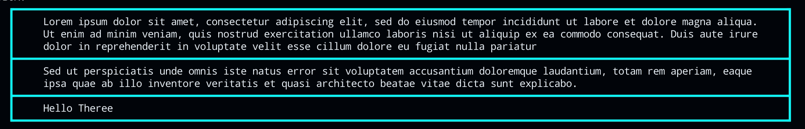

# boxy-cli
[](https://github.com/BastaMasta/boxy-cli)
[](https://crates.io/crates/boxy-cli)
[](https://docs.rs/boxy-cli/latest/)
[](https://crates.io/crates/boxy-cli)
[](https://github.com/BastaMasta/boxy-cli/blob/main/LICENSE-APACHE)
[](https://github.com/BastaMasta/boxy-cli/blob/main/LICENSE-MIT)
[](https://github.com/BastaMasta/boxy-cli/actions/workflows/rust.yml?query=branch%3Amain)


**A Crate to create boxes in command-line interfaces with Rust**

Dual-licensed under [Apache 2.0](https://github.com/BastaMasta/boxy-cli/blob/main/LICENSE-APACHE) or [MIT](https://github.com/BastaMasta/boxy-cli/blob/main/LICENSE-MIT).

## About:
**boxy-cli** is a crate to create simple textboxes in command-line interfaces, with a simple and easy-to-use design.

### How to use:

#### Using the Builder:
you can directly create (and simutaneously print the textbox) using the BoxyBuilder Struct. here is how to use it:

Importing the necessary:

```rust
use boxy_cli::prelude::*;
```

Next, you can create the BoxyBuilder struct

```rust
let mut my_box = Boxy::builder()
        .box_type(BoxType::Double)
        .color("#00ffff")
        .padding(BoxPad::uniform(1), BoxPad::from_tldr(2, 2, 1, 1))
        .align(BoxAlign::Center)
        .add_segment("Hello, Boxy!", "#ffffff")
        .add_line("This is a new line.", "#32CD32")
        .add_segment("Another section", "#663399")
        .width(50)
        .build();
```

and now, display it:

```rust
my_box.display();
```

Or do both simultanrously:
```rust
Boxy::builder()
        .box_type(BoxType::Double)
        .color("#aaffff")
        .padding(BoxPad::uniform(1), BoxPad::from_tldr(2, 2, 1, 1))
        .align(BoxAlign::Center)
        .add_segment("Hello, Boxy!", "#ffffff")
        .add_line("This is a new line.", "#32CD32")
        .add_segment("Another section", "#f19356")
        .width(50)
        .build()
        .display();
```

further, you can use the same methods as displayed above to modify the textbox before building.

But you can also modify the textbox after building it (before displaying) using the methods shown in the following section.

#### Using the Struct and methods.

First, import the crate into the current scope, using:

```rust
use boxy_cli::prelude::*;
```

Next you create a new boxy struct with either the ```new``` method:

```rust
let mut box1 = Boxy::new(BoxType::Double,"#00ffff");
```
or the macro:

```rust
let mut box2 = boxy!(type: BoxType::Double, color:"#00ffff");
```
*for more info on the macro, view the [macro documentation](https://docs.rs/boxy-cli/0.1.0/boxy_cli/macro.boxy.html)*

Next, we just add in text sections:
```rust
box1.add_text_sgmt("Lorem ipsum dolor sit amet", "#fffff");
```
Add some more text to the same segment (or the latest segment):
```rust
box1.add_text_line("consectetur adipiscing elit", "#32CD32");
```
or to a segment with a particular index:
```rust
box1.add_text_line_indx(" consectetur adipiscing elit", "#32CD32", 0);
```
Once you are done, display the TextBox:
```rust
box1.display();
```

*The text color is a required argument and will be implemented into a usable feature in the very near future. But for now, it does not work*


## Examples:

### Textbox 1

```rust
use boxy_cli::prelude::*;

fn main() {
    let mut box1 = Boxy::new(BoxType::Double,"#bfff00");
    box1.add_text_sgmt("Lorem ipsum dolor sit amet, consectetur adipiscing elit, sed do eiusmod tempor incididunt ut labore et dolore magna aliqua. Ut enim ad minim veniam, quis nostrud exercitation ullamco laboris nisi ut aliquip ex ea commodo consequat. Duis aute irure dolor in reprehenderit in voluptate velit esse cillum dolore eu fugiat nulla pariatur", "#ffff");
    box1.add_text_sgmt("Sed ut perspiciatis unde omnis iste natus error sit voluptatem accusantium doloremque laudantium, totam rem aperiam, eaque ipsa quae ab illo inventore veritatis et quasi architecto beatae vitae dicta sunt explicabo.", "#ffff");
    box1.add_text_sgmt("Hello Theree", "#ffff");
    box1.display();
}
```
### Output:


### Textbox 2:

```rust
use boxy_cli::prelude::*;

fn main() {
    let mut box1 = Boxy::new(BoxType::Bold,"#00ffff");
    box1.add_text_sgmt("Lorem ipsum dolor sit amet, consectetur adipiscing elit, sed do eiusmod tempor incididunt ut labore et dolore magna aliqua. Ut enim ad minim veniam, quis nostrud exercitation ullamco laboris nisi ut aliquip ex ea commodo consequat. Duis aute irure dolor in reprehenderit in voluptate velit esse cillum dolore eu fugiat nulla pariatur", "#ffff");
    box1.add_text_sgmt("Sed ut perspiciatis unde omnis iste natus error sit voluptatem accusantium doloremque laudantium, totam rem aperiam, eaque ipsa quae ab illo inventore veritatis et quasi architecto beatae vitae dicta sunt explicabo.", "#ffff");
    box1.add_text_sgmt("Hello Theree", "#ffff");
    box1.display();
}
```

### Output (Wider terminal):



