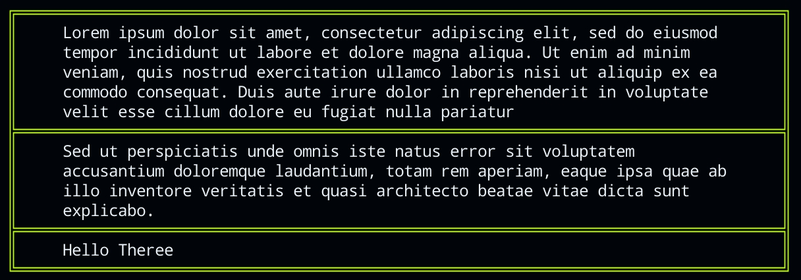

# boxy-cli
A Crate to create boxes in command-line interfaces with Rust

## Example:

### Textbox 1

```rust
use boxy_cli::prelude::*;


fn main() {
    let mut box1 = Boxy::new(BoxType::Double,"#bfff00");
    box1.add_text_sgmt("Lorem ipsum dolor sit amet, consectetur adipiscing elit, sed do eiusmod tempor incididunt ut labore et dolore magna aliqua. Ut enim ad minim veniam, quis nostrud exercitation ullamco laboris nisi ut aliquip ex ea commodo consequat. Duis aute irure dolor in reprehenderit in voluptate velit esse cillum dolore eu fugiat nulla pariatur", "#ffff");
    box1.add_text_sgmt("Sed ut perspiciatis unde omnis iste natus error sit voluptatem accusantium doloremque laudantium, totam rem aperiam, eaque ipsa quae ab illo inventore veritatis et quasi architecto beatae vitae dicta sunt explicabo.", "#ffff");
    box1.add_text_sgmt("Hello Theree", "#ffff");
    box1.display();
    }
```
### Output:

